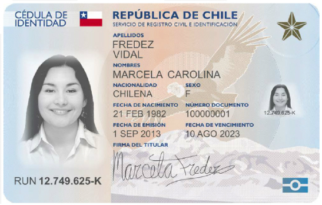
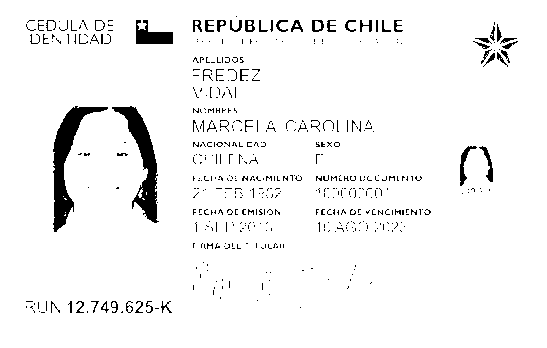
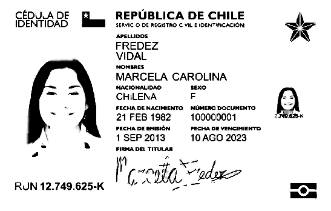

# OpenCBee 👓🐝

Flask API for text recognition of documents with [OpenCV](https://opencv.org/) and [Tesseract OCR](https://github.com/tesseract-ocr/tesseract) with [Robust Locally-Adaptive Soft Binarization](https://stackoverflow.com/a/57103789) for better performance in detecting the text.

## Example (C.N.I: Cedula de Identidad Nacional)

### Original picture



### Simple B&W



```
SUN 12.749.625-K

REPUBLICA DE CHILE i,
toe re ale

wR

aes
VEDAL

MARCEI & CAROLINA

Crna oF ( \
pe tata Te

  

tall BO

2:

 

WAG
```

### Adaptive binarization



```
CEDULA DE REPUBLICA DE CHILE

IDENTIDAD.

 

RUN 12.749.625-K

SEIVIC © DE REGISTRO C VIL EIDENTINCACION.

APELUDOS
FREDEZ

VIDAL

Nonnres.

MARCELA CAROLINA
MACIONALIDAD ‘sexo
CHILENA F

FECHA DENACIMENTO NUMERO OCUMENTO
21 FEB 1982 100000001
PECHADEEMIEION FECHA DE-VENCIMIENTO.
1 SEP 2013 10 AGO 2023

c-cleMeda=
```