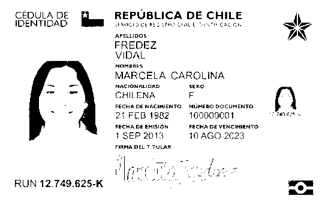
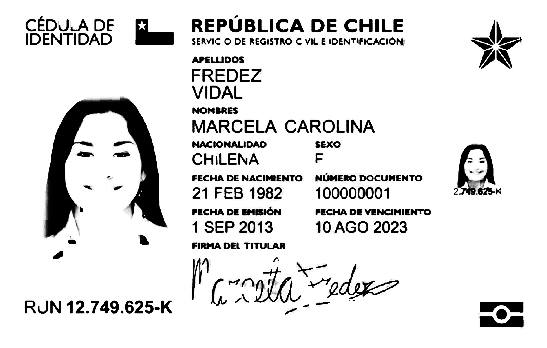

[](https://github.com/Beetrack/documents-recognition-OpenCBee/actions)

# OpenCBee 👓 🐝

Flask API for text recognition of documents with [OpenCV](https://opencv.org/) and [Tesseract OCR](https://github.com/tesseract-ocr/tesseract) with [Robust Locally-Adaptive Soft Binarization](https://stackoverflow.com/a/57103789) for better performance in detecting the text.

## Config

To configure the API you have to execute the following command
```sh
python3 setup.py develop
```

## Running

To configure the API you have to execute the following command
```sh
python3 run.py
```

## Testing

To run the tests you have to execute the following command
```sh
pytest --cov-report term-missing --cov=app app/tests/
```

## Example (C.N.I: Cedula de Identidad Nacional)

### Original picture


### Simple B&W



What OpenCV interprets:
```
SANS Mem REPUBLICA DE CHILE i

   

preuibos WT
FREDEZ

VIDAL

MARCELA CAROLINA

CHILENA F

24 FEB 1982 1909009001 FANE

1 SEP 2013, 10 AGO 2623

 

   

re

is

 

RUN 12.749.625-K

a
```

### Adaptive binarization



What OpenCV interprets:
```
CEDULA DE REPUBLICA DE CHILE

IDENTIDAD.

 

RUN 12.749.625-K

SEIVIC © DE REGISTRO C VIL EIDENTINCACION.

APELUDOS
FREDEZ

VIDAL

Nonnres.

MARCELA CAROLINA
MACIONALIDAD ‘sexo
CHILENA F

FECHA DENACIMENTO NUMERO OCUMENTO
21 FEB 1982 100000001
PECHADEEMIEION FECHA DE-VENCIMIENTO.
1 SEP 2013 10 AGO 2023

c-cleMeda=
```
